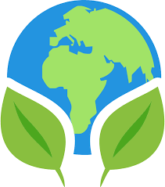

<a name="readme-top"></a>
<!-- PROJECT LOGO -->
<br />
<div align="center">
  <a href="https://environment-pledge-wall.netlify.app/">
    
  </a>
  <h3 align="center">Environment Pledge Wall</h3>  
</div>

<!-- ABOUT THE PROJECT -->
## About The Project

[[Watch the video]](https://www.veed.io/view/4eae7cca-c6c5-4d14-a636-c788cd4c4d46?sharingWidget=true&panel=share)

This project is built upon the MERN stack. Tech used: React, Material UI, Axios, Redux, Figma, MongoDB, Google Analytics, Netlify.

Given below is the functionality:
* Sign Up for first-time users. Login and logout
* Introduction section with social plugins to share your pledge.
* A call to action button to encourage users to pledge.
* Form for taking a pledge. Display of pledge wall.
* Message to save environment :smile:

<p align="right">(<a href="#readme-top">back to top</a>)</p>

<!-- GETTING STARTED -->
## Getting Started

Below are some links to get started:
* Netlify:  https://environment-pledge-wall.netlify.app/
* Figma: https://bitly.ws/ZtFZ
* Google Analytics: https://bitly.ws/ZtG8
* MongoDB Atlas: https://bitly.ws/ZtGk

To install and run on the local machine:
1. Clone the repo
   ```sh
   git clone https://github.com/chetna14/Environment-Pledge-Wall.git
   ```
2. Install NPM packages
   ```sh
   npm install
   ```
3. cd to the client folder and run npm start

<!-- USAGE EXAMPLES -->
## Usage

If data doesn't get loaded/reflected in the first time, refresh your application and try again.
<p align="right">(<a href="#readme-top">back to top</a>)</p>
